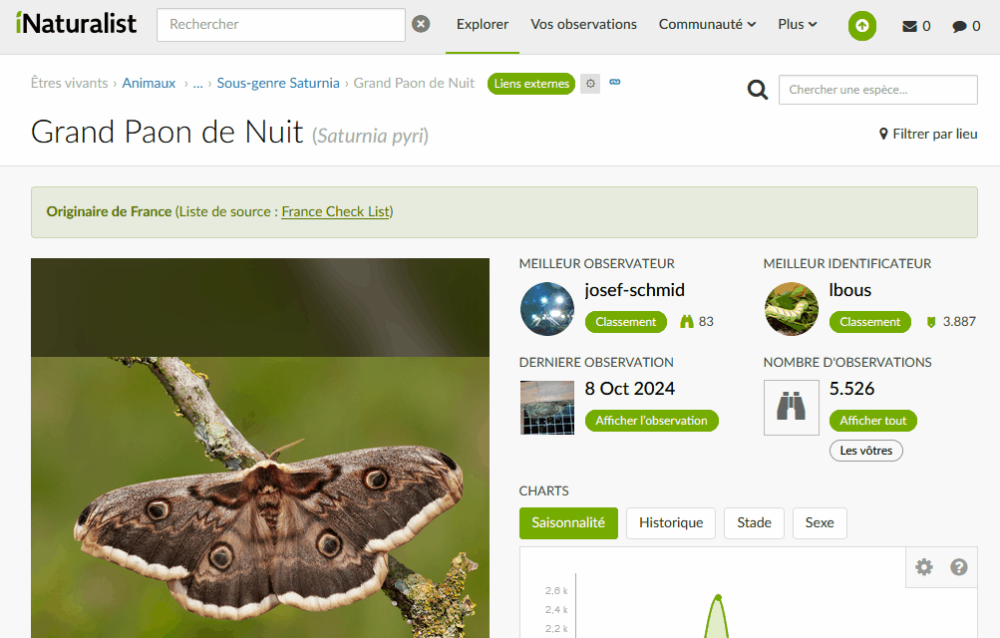

# iNaturalist external links userscript
Userscript Tampermonkey to add external Links to iNaturalist taxon pages

Adds a dropdown with links to external species pages on iNaturalist taxon pages, with a settings button to control visible links.

Presentation : https://forum.inaturalist.org/t/add-external-links-on-taxon-pages/57148

# Userscript
[External Links Userscript](./script.js)

# Demo

# References
https://www.inaturalist.org

https://www.tampermonkey.net/

https://greasyfork.org/scripts/510114
